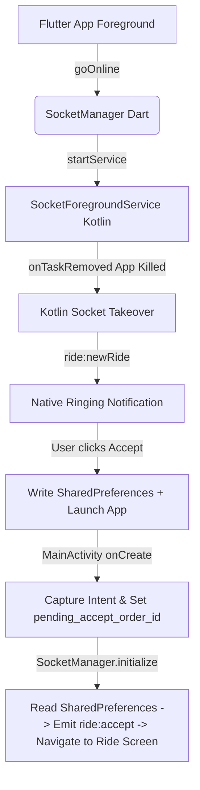

# Ride Flow Integration Plan (Socket & Native Kotlin Background Service Takeover)

This document outlines the detailed plan for integrating the socket-based ride flow, duty toggling, multi-ride request queue, and the background native Android Kotlin service from `Rupesh-Flutter-NZCU` into the Riverpod-based `reachu_driver` project.

---

## Technical Context & Architecture Audit

In `Rupesh-Flutter-NZCU`, the background ride-coming functionality uses a **dual-takeover socket architecture**:
1. **Foreground state (Flutter app alive)**: Sockets are handled in Dart via `SocketManager` using `socket_io_client`.
2. **Killed state (Flutter app destroyed)**: Sockets are handled in native Kotlin via `SocketForegroundService` using the Socket.io Java Client.
3. **Transition**:
   - When the app is in the foreground, the Kotlin service keeps running as a location tracking foreground service but does *not* connect its socket.
   - When the app is killed (detected by `onTaskRemoved` in Kotlin), the Kotlin service connects its native socket to receive ride requests.
   - When a ride is received natively, a heads-up notification is shown with **Accept** and **Decline** actions.
   - Tapping **Accept** opens the app and sets `flutter.pending_accept_order_id` in `SharedPreferences`. Flutter reads this on cold-start and triggers the API call and navigation.
   - When the app is opened, it sets the state to Foreground, and the Kotlin service disconnects its native socket.

### Target Architecture in `reachu_driver`
- **State Management**: `flutter_riverpod` (with generated code via `riverpod_generator`).
- **Package Name**: `com.reachu.driver`
- **Theme**: Premium light/dark theme configured via [AppColors](file:///e:/work/reachu_driver/lib/app/theme/app_colors.dart) (e.g., `primary500`, `darkSurface02`, `lightSurface01`) and [AppDimensions](file:///e:/work/reachu_driver/lib/app/theme/app_dimensions.dart).
- **Routing**: `go_router`
- **Networking**: `dio` (with custom repositories and clients)

---

## Proposed Technical Implementation (Option 1 - Direct Takeover & Adapt)

We will use the **Direct Takeover Architecture**, modified to match the target app's typography, design aesthetics, and state management rules:



### 1. Android Kotlin & Native Configuration

#### A. Copy & Modify Native Files
- **Copy Service**: Copy `SocketForegroundService.kt` to `android/app/src/main/kotlin/com/example/reachu_driver/SocketForegroundService.kt`.
- **Copy Receivers**:
  - Copy `BootReceiver.kt` to `android/app/src/main/kotlin/com/example/reachu_driver/BootReceiver.kt`.
  - Copy `RideActionReceiver.kt` to `android/app/src/main/kotlin/com/example/reachu_driver/RideActionReceiver.kt`.
- **Modify Package Names**:
  - Update all package declarations to `package com.reachu.driver`.
  - Update action intents from `com.nzcu_driver.*` to `com.reachu.driver.*`.
- **Add Raw Resources**:
  - Copy the ringing sound file (`ride_sound.mp3` or similar) to `android/app/src/main/res/raw/ride_sound.mp3` so the native heads-up notification plays the custom ringtone.

#### B. Update `MainActivity.kt` & Application Class
- Modify `MainActivity.kt` to inherit from `FlutterFragmentActivity` and implement the MethodChannel handler for `com.reachu.driver/background_service`.
- Handle calls: `startService`, `stopService`, `updateNotification`, `setAppState`, `bringToFront`, `cancelRideNotification`, `launchIntent`.
- Implement `handleIntentExtras()` in `onCreate` and `onNewIntent` to capture ACCEPT clicks and write `flutter.pending_accept_order_id` to `SharedPreferences` so the Dart side is triggered on startup.
- Create `ReachuDriverApplication.kt` (inheriting from `FlutterApplication`) to register the status notification channel (`STATUS_CHANNEL_ID` - importance low), ride request channel (`RIDE_CHANNEL_ID` - importance high + insistent sound), and chat channel.

#### C. Modify `AndroidManifest.xml`
- Add necessary system permissions (`ACCESS_FINE_LOCATION`, `ACCESS_BACKGROUND_LOCATION`, `WAKE_LOCK`, `RECEIVE_BOOT_COMPLETED`, `SYSTEM_ALERT_WINDOW`, `FOREGROUND_SERVICE`, `FOREGROUND_SERVICE_LOCATION`, etc.).
- Set the `android:name` attribute of the `<application>` element to `.ReachuDriverApplication`.
- Register the `SocketForegroundService`, `RideActionReceiver`, and `BootReceiver` components.

---

### 2. Dart Sockets & Riverpod Integration

Instead of raw singletons with floating GetX controllers, we will wrap the core socket interface in Riverpod state providers:

#### A. Core Socket Client
- Complete the placeholder [socket_client.dart](file:///e:/work/reachu_driver/lib/core/socket/socket_client.dart) to configure `socket_io_client`.
- Populate [socket_events.dart](file:///e:/work/reachu_driver/lib/core/socket/socket_events.dart) with the two accepted socket events we care about:
  1. `ride:newRide` (Incoming ride proposal)
  2. `ride:orderCancelled` (Ride cancellation)
  - Also preserve events needed for authentication and duty states (`user:online`, `driver:offline`, `driver:online_success`, `driver:online_failed`).

#### B. Socket Manager
- Create `SocketManager` as the core client interface.
- Expose the connection state, duty status, and current active ride using a generated Riverpod notifier `socketManagerProvider` (`socket_manager_provider.dart`):
  ```dart
  @riverpod
  class SocketManagerNotifier extends _$SocketManagerNotifier {
    @override
    SocketState build() {
      // Initialize SocketManager instance and listen to state changes
    }
    // goOnline, goOffline, acceptRide, declineRide
  }
  ```

#### C. Multi-Ride Request Queue Notifier
- Create a reactive state list under `lib/features/booking/providers/ride_queue_provider.dart`:
  ```dart
  @riverpod
  class RideQueueNotifier extends _$RideQueueNotifier {
    @override
    List<RideRequestItem> build() => [];
    
    void addRide(Map<String, dynamic> data) { ... }
    void removeRide(String orderId) { ... }
    void clearAll() { ... }
  }
  ```
- Each request card has a linear countdown timer. The timer logic should be reactive, updating `progress` and `remainingSeconds` using a periodic notifier.

---

### 3. UI, Theming & Screen Layouts

All widgets and screens will use the design system tokens defined in [AppColors](file:///e:/work/reachu_driver/lib/app/theme/app_colors.dart) and [AppDimensions](file:///e:/work/reachu_driver/lib/app/theme/app_dimensions.dart):

#### A. Online/Offline Switch (`HomeScreen`)
- Connect the duty switch in [home_screen.dart](file:///e:/work/reachu_driver/lib/features/home/ui/home_screen.dart) to watch the `socketManagerProvider` state.
- When toggled on, verify location/battery permissions via a premium dialogue, then trigger `ref.read(socketManagerProvider.notifier).goOnline()`.
- Use the semantic `successLight` for the online track color and `neutral500` for offline state.

#### B. Ride Request Queue Screen (`RideRequestQueueScreen`)
- Create `lib/features/booking/ui/ride_request_queue_screen.dart` using a clean, modern layout:
  - Gradient background transitioning from `lightSurface01` to `lightSurface00` (or dark mode equivalents).
  - Glassmorphic card styling for the request cards.
  - Safe back-press handler using `PopScope` to prevent drivers from dismissing the screen without accepting/declining.

#### C. Ride Request Card Widget (`RideRequestCard`)
- Create a premium container matching the app's visual aesthetics:
  - Display pickup address (with `neutral900`/`darkTextPrimary` color) and dropoff address (with `errorDark` marker).
  - Show a circular or linear countdown indicator using `primary500` brand color.
  - Display fare with custom typography (`AppTextStyles`).
  - Provide **Accept** and **Decline** buttons using [AppButton](file:///e:/work/reachu_driver/lib/shared/widgets/app_button.dart).

---

## Verification Plan

### Automated Build Verification
1. Run Riverpod generator:
   `flutter pub run build_runner build --delete-conflicting-outputs`
2. Test Android build compile:
   `flutter build apk --debug`

### Manual Scenario Verification
1. **Duty Toggle**: Turn switch ON. Verify:
   - Kotlin service starts.
   - Status notification "You are Online" appears in the tray.
   - Socket connects and emits `user:online`.
2. **Foreground Incoming Ride**: Emit `ride:newRide` via backend. Verify:
   - `RideRequestQueueScreen` pushes onto the navigator.
   - Circular countdown runs smoothly.
   - Accept/Decline works natively.
3. **Background Notification Takeover**: Minimize the app. Emit `ride:newRide`. Verify:
   - Insistent heads-up notification rings.
   - Tapping Accept opens the app, clears the card, and goes straight to active ride view.
4. **Killed State Takeover**: Force kill the app. Verify:
   - Kotlin service stays alive (sticky) and connects its native socket.
   - Receiving a ride triggers the heads-up ringing notification.
   - Tapping Accept launches the app and emits `ride:accept` from Dart using the cached SharedPreferences token.
